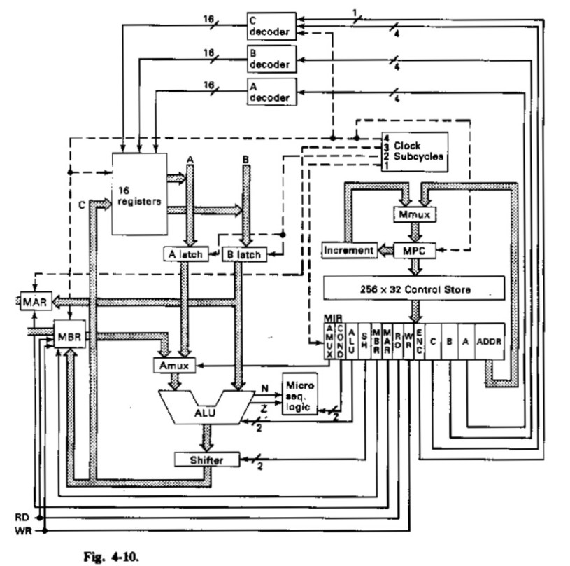

### MACROINSTRUÇÃO

| Binário | Mnemonic | Instrução | Significado |
| :---: | :---: | :---: | :---: |
| 0000xxxxxxxxxxxx | LODD | Load direct | ac := m[x] |
| 0001xxxxxxxxxxxx | STOD | Store direct | m[x] := ac |
| 0010xxxxxxxxxxxx | ADDD | Add direct | ac := ac + m[x] |
| 0011xxxxxxxxxxxx | SUBD | Subtract direct | ac := ac - m[x] |
| 0100xxxxxxxxxxxx | JPOS | Jump positive | if ac >= 0 then pc := x |
| 0101xxxxxxxxxxxx | JZER | Jump zero | if ac == 0 then pc := x |
| 0110xxxxxxxxxxxx | JUMP | Jump | pc := x |
| 0111xxxxxxxxxxxx | LOCO | Load constant | ac := x (0 <= x <= 4095) |
| 1000xxxxxxxxxxxx | LODL | Load local | ac := m[sp + x] |
| 1001xxxxxxxxxxxx | STOL | Store local | m[sp + x] := ac |
| 1010xxxxxxxxxxxx | ADDL | Add local | ac := ac + m[sp + x] |
| 1011xxxxxxxxxxxx | SUBL | Subtract local | ac := ac - m[sp + x] |
| 1100xxxxxxxxxxxx | JNEG | Jump negative | if ac < 0 then pc := x |
| 1101xxxxxxxxxxxx | JNZE | Jump nonzero | if ac != 0 then pc := x |
| 1110xxxxxxxxxxxx | CALL | Call procedure | sp := sp - 1; m[sp] := pc; pc := x |
| 1111000000000000 | PSHI | Push indirect | sp := sp - 1; m[sp] := m[ac] |
| 1111001000000000 | POPI | Pop indirect | m[ac] := m[sp]; sp := sp + 1 |
| 1111010000000000 | PUSH | Push onto stack | sp := sp - 1; m[sp] := ac |
| 1111011000000000 | POP | Pop from stack | ac := m[sp]; sp := sp + 1 |
| 1111100000000000 | RETN | Return | pc := m[sp]; sp := sp + 1 |
| 1111101000000000 | SWAP | Swap ac, sp | tmp := ac; ac := sp; sp := tmp |
| 11111100yyyyyyyy | INSP | Increment sp | sp := sp + y (0 <= y <= 255) |
| 11111110yyyyyyyy | DESP | Decrement sp | sp := sp - y (0 <= y <= 255) |

* `xxxxxxxxxxxx` is a 12-bit machine address (x).
* `yyyyyyyy` is an 8-bit constant (y).

---

### MICROINSTRUÇÃO

| Endereço | Microinstrução | Macro | Significado |
| :---: | :--- | :--- | :--- |
| 0 | mar:=pc; rd; | Busca | Busca da instrução |
| 1 | pc:=pc + 1; rd; | Busca | Incrementa PC |
| 2 | ir:=mbr; if n then goto 28; | Busca/Identifica | Decodificação (bit 15) |
| 3 | tir:=lshift(ir + ir); if n then goto 19; | Identifica | Decodificação (bit 14) |
| 4 | tir:=lshift(tir); if n then goto 11; | Identifica | Decodificação (bit 13) |
| 5 | alu:=tir; if n then goto 9; | Identifica | Decodificação (bit 12) |
| 6 | mar:=ir; rd; | Executa {0000 = LODD} | {0000 = LODD} Início |
| 7 | rd; | Executa | Aguarda memória |
| 8 | ac:=mbr; goto 0; | Executa | LODD Fim |
| 9 | mar:=ir; mbr:=ac; wr; | {0001 = STOD} | {0001 = STOD} Início |
| 10 | wr; goto 0; | Executa | STOD Fim |
| 11 | alu:=tir; if n then goto 15; | Identifica | Decodificação |
| 12 | mar:=ir; rd; | {0010 = ADDD} | {0010 = ADDD} Início |
| 13 | rd; | Executa | Aguarda memória |
| 14 | ac:=mbr + ac; goto 0; | Executa | ADDD Fim |
| 15 | mar:=ir; rd; | {0011 = SUBD} | {0011 = SUBD} Início |
| 16 | ac:=ac + 1; rd; | Executa | Prepara complemento de 2 |
| 17 | a:=inv(mbr); | Executa | Inverte MBR |
| 18 | ac:=ac + a; goto 0; | Executa | SUBD Fim |
| 19 | tir:=lshift(tir); if n then goto 25; | Identifica | Decodificação de saltos |
| 20 | alu:=tir; if n then goto 23; | | Decodificação |
| 21 | alu:=ac; if n then goto 0; | {0100 = JPOS} | JPOS: se neg, não pula |
| 22 | pc:=band(ir, amask); goto 0; | | Efetua o pulo (PC := endereço) |
| 23 | alu:=ac; if z then goto 22; | {0101 = JZER} | JZER: se zero, pula |
| 24 | goto 0; | | Fim JZER |
| 25 | alu:=tir; if n then goto 27; | | Decodificação |
| 26 | pc:=band(ir, amask); goto 0; | {0110 = JUMP} | {0110 = JUMP} |
| 27 | ac:=band(ir, amask); goto 0; | {0111 = LOCO} | {0111 = LOCO} |
| 28 | tir:=lshift(ir + ir); if n then goto 40; | | Decodificação instruções 1xxx |
| 29 | tir:=lshift(tir); if n then goto 35; | | Decodificação |
| 30 | alu:=tir; if n then goto 33; | | Decodificação |
| 31 | a:=ir + sp; | {1000 = LODL} | Calcula endereço local |
| 32 | mar:=a; rd; goto 7; | | {1000 = LODL} |
| 33 | a:=ir + sp; | {1001 = STOL} | |
| 34 | mar:=a; mbr:=ac; wr; goto 10; | | {1001 = STOL} |
| 35 | alu:=tir; if n then goto 38; | | |
| 36 | a:=ir + sp; | {1010 = ADDL} | |
| 37 | mar:=a; rd; goto 13; | | {1010 = ADDL} |
| 38 | a:=ir + sp; | {1011 = SUBL} | |
| 39 | mar:=a; rd; goto 16; | | {1011 = SUBL} |
| 40 | tir:=lshift(tir); if n then goto 46; | | |
| 41 | alu:=tir; if n then goto 44; | | |
| 42 | alu:=ac; if n then goto 22; | {1100 = JNEG} | {1100 = JNEG} |
| 43 | goto 0; | | | |
| 44 | alu:=ac; if z then goto 0; | | {1101 = JNZE} | |
| 45 | pc:=band(ir, amask); goto 0; | {1101 = JNZE} |
| 46 | tir:=lshift(tir); if n then goto 50; | | |
| 47 | sp:=sp + (-1); | {1110 = CALL} | Prepara pilha para CALL |
| 48 | mar:=sp; mbr:=pc; wr; | | Salva PC na pilha |
| 49 | pc:=band(ir, amask); wr; goto 0; | | {1110 = CALL} |
| 50 | tir:=lshift(tir); if n then goto 65; | | Instruções 1111xxxx |
| 51 | tir:=lshift(tir); if n then goto 59; | | |
| 52 | alu:=tir; if n then goto 56; | | |
| 53 | mar:=ac; rd; | {1111-0000 = PSHI} | {1111-0000 = PSHI} |
| 54 | sp:=sp + (-1); rd; | | |
| 55 | mar:=sp; wr; goto 10; | | |
| 56 | mar:=sp; sp:=sp + 1; rd; | {1111-0010 = POPI} | {1111-0010 = POPI} |
| 57 | rd; | | |
| 58 | mar:=ac; wr; goto 10; | | |
| 59 | alu:=tir; if n then goto 62; | | |
| 60 | sp:=sp + (-1); | {1111-0100 = PUSH} | {1111-0100 = PUSH} |
| 61 | mar:=sp; mbr:=ac; wr; goto 10; | | |
| 62 | mar:=sp; sp:=sp + 1; rd; | {1111-0110 = POP} | {1111-0110 = POP} |
| 63 | rd; | | |
| 64 | ac:=mbr; goto 0; | | |
| 65 | tir:=lshift(tir); if n then goto 73; | | |
| 66 | alu:=tir; if n then goto 70; | | |
| 67 | mar:=sp; sp:=sp + 1; rd; | {1111-1000 = RETN} | {1111-1000 = RETN} |
| 68 | rd; | | |
| 69 | pc:=mbr; goto 0; | | |
| 70 | a:=ac; | {1111-1010 = SWAP} | {1111-1010 = SWAP} |
| 71 | ac:=sp; | | |
| 72 | sp:=a; goto 0; | | |
| 73 | alu:=tir; if n then goto 76; | | |
| 74 | a:=band(ir, smask); | {1111-1100 = INSP} | {1111-1100 = INSP} |
| 75 | sp:=sp + a; goto 0; | | |
| 76 | a:=band(ir, smask); | {1111-1110 = DESP} | {1111-1110 = DESP} |
| 77 | a:=inv(a); | | |
| 78 | a:=a + 1; goto 75; | | Complemento de 2 para sub |

  

### Regras da Memória Principal

Endereços: 
  1 a 1000 - instruções
  1001 a 2000 - dados
  3001 a 4095 - pilha